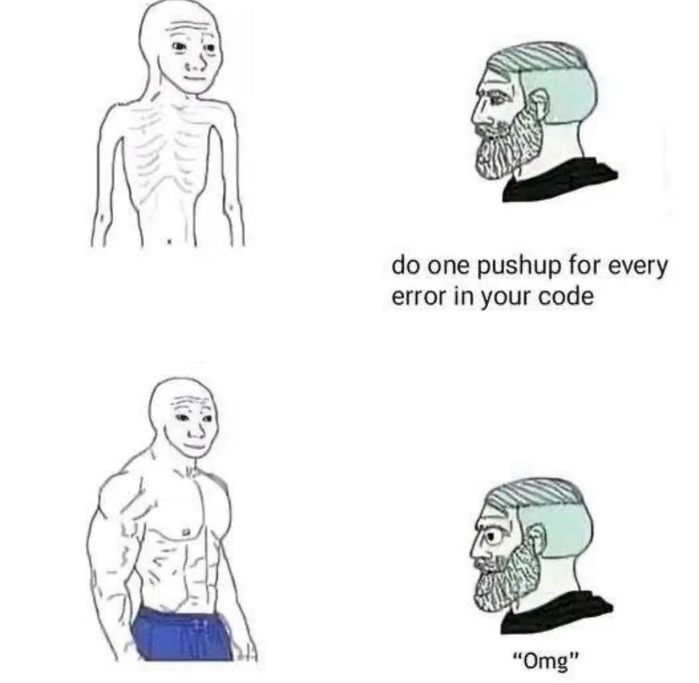

## Introduction

In this _blog_ post, I'll be walking you through the process of building my personal portfolio website using Next.js TailwindCSS, Velite and, of course, GitHub Copilot as my junior web developer. As a young data scientist and budding entrepreneur, I needed a clean, professional online space to showcase my projects, blog posts, articles (and lessons, coming soon 😉), all while leveraging modern web development tools. By combining the power of Next.js, TailwindCSS and Velite, I've created a simple and responsive portfolio that highlights my journey in data science, software design and creativity with a touch of personality. Let's dive into how I built this website.

## Why did I build a website?

Because I thought it would be fun (trust me, it wasn’t). But seriously, why? 3 reasons:

1. Showcase my work to expand opportunities and boost credibility - Having a portfolio website gives me the perfect platform to present my projects and accomplishments in a way that’s detailed, interactive, and far more engaging than a simple resume or a short LinkedIn post. It’s like having a 24/7 showcase that potential employers, collaborators, or clients can explore, which opens the door to new opportunities and builds trust in my skills and expertise.
2. Build my personal brand and share my voice - I wanted a space where I could truly express who I am-not just as a data scientist but as a thinker, writer, and innovator. Through my website, I can share my unique perspective, write about topics I care about, and craft a professional identity that resonates with others in my field. It’s about standing out and letting my voice be heard.
3. Share well-explained (tutorial) lessons - One thing I’ve noticed is the lack of well-explained, beginner-friendly tutorials in certain areas of data science, machine learning, mathematics and statistics. My website gives me a platform to fill that gap by sharing clear, practical lessons and insights that others can learn from. If I can make someone’s learning journey a little easier, that’s a win for me! (Spoiler: The learning page is a whole different project on its own, and is still in the pipeline).

## Stages of the project

I started this endeavour at the start of the winter break and had only 3 weeks to get it done. I had a part-time job to juggle so I needed tools to make my life easy and speed up the development process.

- Planning the project: The whole project was organized with [Notion](https://www.notion.com/). Notion is an all-in-one workplace application that combines notes, documents, tasks, and project management into a single platform. It offers a versatile environment for personal (which is how I use it) and team productivity (offers a Pro plan for teams), allowing users to create and organize content.
- Getting Inspiration: I had an idea of what I wanted it to look like. For the longest time I had always wanted to build my portfolio website, I had a folder of bookmarks of all the websites I would like to copy. Websites that I got inspiration from include;
  - [awwwards](https://www.awwwards.com/)
  - [Behance](https://www.behance.net/)
  - [Dribble](https://dribbble.com/)
  - [SLP](https://saaslandingpage.com/)
  - [Vercel](https://vercel.com/templates)
  - [Codrops](https://tympanus.net/codrops/)
- Designing the website: I designed the website for [Figma](https://www.figma.com). Figma Design is a great web application for all kinds of interface designs, from websites and mobile to desktop applications. It includes prototyping features and allows you to share and collaborate with clients and team members (design ). It has a user-friendly interface (I would be disappointed if it didn’t). It also has a free tier, which offers unlimited personal drafts and a maximum of 3 collaborative design files. When designing the website, I came across
- Building the project: After designing my website, I had to pick the stack and tools, I would use to build it. I landed on Next.js, tailwindCSS and Velite. I choose Next.js and tailwindCSS because I have had prior experience with them and it would just make my life a little easier because I was on a timeline. I choose Velite because it would make it easy to post blog posts and articles with markdown.
- Deployment: I deployed the site on GitHub (more below).

## The Project Stack

- [NextJS](https://nextjs.org/)
- [TypeScript](https://www.typescriptlang.org/)
- [TailwindCSS](https://tailwindcss.com/)
- [Velite](https://velite.js.org/)

## Why Next.js

I went with Next.js as the backbone of my website. Next.js is a tool that helps developers build websites that are really fast, efficient and easy to find on Google. It makes sure that the pages people see are ready to go right away. Next.js is built on top of **React.js**. It takes React’s capabilities for building user interfaces and adds additional features like server-side rendering, static site generation, and routing, which make it easier to build modern, high-performance web applications. It has many more benefits like image optimizations and code-splitting which you can look into further if you are interested.

## Typing TypeScript

TypeScript is like an upgrade to JavaScript, which is a language that developers use to build websites and apps. JavaScript lets you write whatever you want, but TypeScript adds a checklist to make sure your instructions are correct and clear. With TypeScript, developers can catch mistakes earlier in the process, making their code more reliable and easier to understand. It helps prevent errors, especially as projects grow larger and more complex. TypeScript is an open-source, object-oriented programming language developed and maintained by Microsoft Corporation.

## Styling with TailwindCSS

This website also uses Tailwind CSS for styling, along with the `@tailwindcss/typography` plugin for beautiful typography. Tailwind CSS is a utility-first CSS framework that makes it easy to build modern, responsive designs directly within your HTML (or JSX, in this case). Since the project’s pages are built as JSX components, Tailwind CSS became my go-to styling tool, acting as my trusty sidekick for crafting sleek and consistent designs effortlessly. It’s clean, efficient, and a huge time-saver. When digging through the documentation of the tailwind CSS, I came across one of their portfolio website showcases, which I fell in love with - guess what? I ended up copying as much as I could. This quote is my defence (my hands are up).

> If I have seen further, it is by standing on the shoulders of giants. - Sir Isaac Newton

## Using Velite

To manage my content, I experimented with Velite, a lightweight framework designed for content-driven sites. Velite simplifies building type-safe data layers by converting Markdown, MDX, YAML, and JSON files into application-ready data. It allowed me to easily define collections (like articles and blogs) and handle them efficiently. That said, setting up the .velite folder required some troubleshooting. _Pro tip_: Read the docs carefully and double-check your paths in tsconfig.json-it’ll save you some headaches!

## Features of the Project

The project utilized other cutting-edge technologies and tools. Here are some of the key technologies and integrations in this project:

### MDX Integration

With the help of `@mdx-js/loader`, `@mdx-js/react`, and `next-mdx-remote`, the website supports MDX, allowing me to write JSX in Markdown documents. This makes it easy to create rich content pages with interactive components like the one you are reading right now.

### ESLint

To maintain code quality and consistency, the project uses [ESLint](https://eslint.org/) with the `eslint-config-next` configuration. This helps catch potential issues early and enforces best practices.

### Math and LaTeX Support

With the integration of `katex`, `react-katex`, `rehype-katex`, and `remark-math`, the project supports rendering mathematical expressions and LaTeX. This is particularly useful for educational content and will come in handy when I start working on my tutorials page.

### Remark and Rehype Plugins

The website uses various [`remark`](https://github.com/remarkjs/remark) and [`rehype`](https://github.com/rehypejs/rehype) plugins, such as `remark-gfm`, `rehype-autolink-headings`, `rehype-pretty-code`, and `rehype-slug`, to enhance Markdown processing and HTML output. These plugins add features like GitHub Flavored Markdown, automatic heading links, syntax highlighting, and slug generation. To put it simply, these plugins allow me to put in code blocks into Markdown and make it look good.

### DaisyUI

[DaisyUI](https://daisyui.com/) is used to provide a set of pre-designed components that are built on top of Tailwind CSS. This helps speed up the development process by providing ready-to-use UI elements.

### Brevo

The project integrates [Brevo](https://www.brevo.com/) (formerly Sendinblue) for managing the newsletter signup system. This allows seamless collection and management of subscriber emails, ensuring efficient communication with the audience through automated workflows and email campaigns.

### Google Analytics

Would I really be a data scientist without adding some analytics? I have to see the numbers. Using the `@next/third-parties/google` package, the project incorporates Google Analytics to track website traffic, user interactions, and other key metrics. This integration provides insights into user behavior, helping to improve the overall website experience and performance.

## Pages of the Website

- **Homepage**

  The homepage features a clean, intuitive layout designed to welcome visitors and provide easy navigation to key sections. It ensures a smooth user experience with highlights of the most important content.

- **About Page**

  This section offers a well-structured overview of the creator’s professional background, key projects, and notable achievements. It’s designed to give visitors an engaging insight into the journey and expertise behind the website. I integrate a newsletter signup form and pull the latest three articles/blogposts.

- **Projects Page**

  Projects are showcased using dynamic, interactive cards that present each project in an organized and visually appealing manner, making it easy for visitors to explore and engage with my work.

- **Blogs Page**

  The articles section is seamlessly integrated with MDX for dynamic content delivery, offering a smooth and enjoyable reading experience. This page is optimized for easy content updates, ensuring visitors always have access to fresh insights and ideas.

- **Spotify Page**

  A dedicated page showcasing the my current favorite playlists, tracks, or music recommendations, offering a personal touch to the website.

- **Airbnb Page**

  A curated page my Airbnb listings. Each listing includes vibrant photos, detailed descriptions, and a direct link for booking, making it convenient for potential guests to explore and book accommodations with me.

## Deployment

I deployed the project on GitHub Pages, primarily for the simpler .github.io domain name. Deploying a Next.js project to GitHub Pages involves automating the build and deployment process through GitHub Actions [GitHub Actions](https://github.com/actions). The process typically starts with setting up the build job, where dependencies are installed, and the Next.js app is built. The output is then prepared for deployment, and in the deployment step, the built files are pushed to GitHub Pages. Key configurations include specifying the correct Node.js version, caching dependencies for faster builds, and using actions like actions/deploy-pages for seamless deployment to GitHub Pages.

It is important to look into automation because it makes for consistency and saves time. Automating the build and deployment steps eliminates manual errors and increases reliability. GitHub provides common Actions (that’s automations, `.yml`) as a starting point. Most of the time, it should be enough for simple projects.

## Challenges Faced

Not everything was smooth sailing, though.

Next.js 15 introduced changes to how params and searchParams are handled in synchronous and asynchronous components, causing some issues - [Upgrading to Next.js 15](https://nextjs.org/docs/app/building-your-application/upgrading/version-15#asynchronous-page).

I ran into hiccups with dynamic imports, experimental module warnings, and typical dependency problems, requiring deep dives into Node.js warnings and cleaning up node_modules. Additionally, when deploying to GitHub Pages, it’s important to remember that it’s optimized for static sites, meaning dynamic components might not compile and if they do, they might not work as expected.

## Lessons Learned

1. **Efficiency is Key**: With limited time and a part-time job, the importance of choosing the right tools (Next.js, TailwindCSS, Velite) to streamline development became clear. The right stack can make or break your timeline.
2. **Flexibility of Markdown**: Velite’s ability to convert Markdown files into application-ready data (fancy way of saying, what you are reading now is markdown converted) made managing my blog posts and articles easier, but it required some patience. Double-checking paths and configurations in tsconfig.json is essential to avoid unnecessary roadblocks.
3. **Documentation is Your Best Friend**: Whenever facing issues-whether with dynamic imports or deployment to GitHub Pages-the docs were an invaluable resource. Investing time in reading documentation early saved me hours of troubleshooting later. Be sure to read the documentation to stay on top of updates on framework changes.
4. **Design Process Matters**: Taking time to plan and design my site in Figma, despite the limited time, allowing for a smooth development process. A well-organized design can guide you through the building process with greater ease.
5. **Deployment Automation**: Automating deployment through GitHub Actions significantly improved the consistency and reliability of my workflow. Setting up automated builds and deployments is a game-changer. Now, when I have a new blogpost, I simply push it and GitHub Actions handles the rest.

## Conclusion

Building this website was not just a technical challenge but a personal journey of growth. The project pushed me to enhance my development skills and was a good refresher (retired web dev, wink again) while allowing me to reflect on my career as a data scientist, new writer, and life-long learner. By combining Next.js, TailwindCSS, and Velite, I was able to create a visually appealing and functional portfolio that’s both easy to maintain and update. While there were moments of frustration (…sigh…), the experience taught me how to navigate web development workflows efficiently.

## What Next?

Now that my portfolio website is live, the next step is to focus on content. I plan to add more detailed projects, write blog posts on the latest developments in data science and machine learning, and launch a learning page with tutorials to help others in the field. Additionally, I’ll be refining the website’s design and user experience as I continue to explore new web development tools and frameworks.

Stay tuned for updates and future projects!
