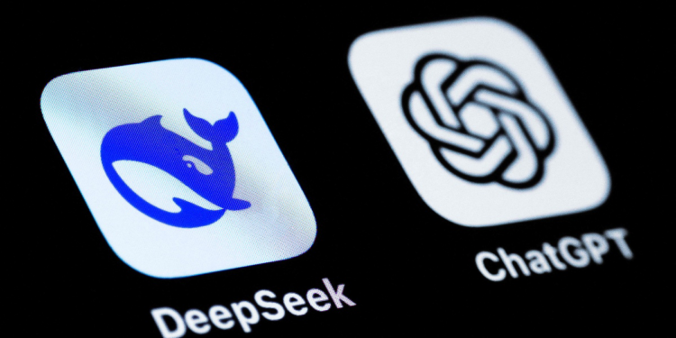

# Introduction

## **What is DeepSeek?**

I am sure you have might have heard or seen “DeepSeek” at least twice in the recent weeks. What exactly is it? Spoiler alert: it’s related to Artificial Intelligence (AI). What does it do? Why is it so important?

Firstly, DeepSeek is the name of a Chinese AI company much like [OpenAI](https://openai.com/), [Palantir](https://www.palantir.com/), Google, [Meta](https://about.meta.com/) and [NVIDIA](https://www.nvidia.com/en-us/). DeepSeek is one of newest companies in the AI space established barely two years ago in 2023. Their first product was an open-source coding model, DeepSeek Coder, followed by series of large language modles.

## **OpenAI open-source?**

Open source means all the code of the software product is free to download, modify and redistribute. This is where everything gets interesting.

<Callout>

Some argue “OpenAI was one of the first ‘open-source’ AI companies now turned ‘closed-source’.” - This statement is not entirely true. OpenAI was never really open-source.

</Callout>

Actually, OpenAI was not originally an open-source company. When it was founded in December 2015, OpenAI's mission was to ensure that artificial general intelligence (AGI) benefits all of humanity. While the organization initially emphasized openness and transparency, it did not fully open-source all of its research or models. It is important to state that in its earlier days, OpenAI was established as a nonprofit organization.

Fast forward after going through various phases of drama, transitioned into a “capped-profit” model (fancy way of saying we can make money but not too much) in 2019. How much is “too much”? This sparked some controversy and questions about whether OpenAI’s original mission has been compromised. Greed could be really dangerous to all of us-chasing short-term gains blinds you to long-term risks, and eventually, bad things happen.

Over time, OpenAI shifted its approach, focusing more on safety and responsible deployment of AI technologies, which led to less open sharing of certain advancements, such as the GPT-3 model. They argue that, this approach keeps everyone safe but does it really? Doesn’t this slow down the rate of development of AI and AGI all together?

Let’s cut OpenAI some slack, they have released other open-source projects like Gym which have been beneficial to developing reinforcement learning algorithms. Besides, most of the other major players in the field are fully loaded with funds to be able to make some meaningful contribution to this research field. It’s kind of a race right now. Anyway, this article is not about OpenAI so let’s refocus.

# **DeepSeek’s newest model**

Finally to the meat of today’s issue. DeepSeek released a new large language model (LLM) called **DeepSeek-R1**. After releasing DeepSeek-LLM and DeepSeek-V3 with little fanfare, DeepSeek-R1 has suddenly become the talk of the AI world. With new LLMs emerging every other day, what sets DeepSeek-R1 apart? What’s so groundbreaking about it that has captured everyone’s attention?

[Try DeepSeek 💬](https://chat.deepseek.com/)

In times when many leaders in the field started saying that *“the lower hanging fruit has already been plucked”*, no one expected an competitive LLM to be these 3 things-(1) high performing, (2) cost effective and (3) open-sourced!

Let me be frank, DeepSeek’s performance metrics are not groundbreaking but significant. For this to make more sense, we need to skip the performance metric point and talk about cost. Training DeepSeek-R1 cost approximately US$5.58 million, a fraction of the estimated US$100 million (aprox. 5.6%) required for OpenAI’s GPT-4.

<Callout>
  These numbers are crazy. US\$100 million is equivalent to 17.92 times more. This means they could train the DeepSeek-R1 model more than 17 times and still not burn through all of OpenAI’s cash.

</Callout>

### What is a token?

Tokens are small pieces of information that a language model reads and understands. In the sentence “I love AI”, the tokens could be “I”, “love”, and “AI” (3 tokens). In “Unbelievable”, the word might be broken into smaller parts “Un”, “believe”, “able” (3 tokens). For numbers or symbols, each one is often a separate token. ”$100” might be: ”$” and “100” (2 tokens). Models process everything in tokens (not whole sentences).

<Callout>

Models like DeepSeek-R1 or ChatGPT-4 can only handle a certain number of tokens at once (e.g., 4,000 tokens ≈ 3 pages of text).

</Callout>

DeepSeek’s cost-effectiveness extends to operational expenses. Processing input tokens with DeepSeek-R1 costs about US$0.55 per million tokens (approx. 750,000 words), compared to GPT-4’s US$30 per million tokens-a reduction of over 98%.

Re-enter performance. At this cost, DeepSeek was able to produce an LLM with comparable performances across various tasks and even beating OpenAI’s o1 model out in some benchmarks. DeepSeek released their cost efficient and effective model for **free** to download by anyone who wants to [Download DeepSeek-R1 here →](https://github.com/deepseek-ai/DeepSeek-LLM?tab=readme-ov-file#2-model-downloads).

If you are thinking these models must be huge, you are right, it’s in the name “Large” Language Model. This is a model with 67 billion parameters requiring substantial hardware resources, particularly in terms of storage and memory. The model’s size is approximately 124.21 GB. It is recommended to have at least two NVIDIA A100 GPUs with 40GB of VRAM each. To get good performance, some say you need up to 1TB of RAM. What is an open-source model if most people cannot actually try it out? There’s a workaround though.

### What is model distillation?

Model distillation is a technique where a smaller, simpler model (called the “student”) is trained to mimic the behavior of a larger, more complex model (called the “teacher”). This is effective because the student is able to learn "how to think" - chain of thought reasoning (decision-making process) - and capture important pattern rather than just knowing everything.

DeepSeek-R1’s development team distilled its advanced reasoning capabilities into smaller, dense 7 billion parameter model, making them more accessible. This distilled model is 14.1GB small and requires only 16GB of VRAM to run (down to 4GB with 4-bit quantization wizardry). Put simply, a MacBook Pro equipped with an M1 Pro, M2 Pro, or higher chipset and at least 16 GB of unified memory should be capable of running DeepSeek’s 7B model. Keep in mind that, even though they can run it, the faster the chip, the fast the rate of output responses.

The DeepSeek-R1 models are currently available on [Huggingface](https://huggingface.co/) (a hub for sharing and collaborating on AI projects) to download.

## US-China Trade Wars

You are probably wondering what trade wars are doing here. Sit tight for this small detour. The escalating trade tensions between the United States and China have led to significant developments in artificial intelligence (AI) advancements. In an effort to curb China’s progress in AI, the U.S. government has implemented series of stringent export controls, notably restricting companies like NVIDIA from exporting advanced AI chips to China.

These measures aim to crip China’s access to high-performance computing resources essential for training and deploying sophisticated AI models. Facing these constraints, Chinese companies have intensified efforts to develop indigenous technologies and explore alternative solutions to mitigate the impact of U.S. sanctions.

This dynamic highlights the complex interplay between international trade policies and technological innovation, illustrating how external pressures can catalyze domestic advancements in critical sectors. The R1 model’s impressive performance were on NVIDIA’s H800 GPUs, which are considered less powerful than the latest offerings.

> Necessity is the mother of invention

The release of DeepSeek’s R1 model had a significant impact on the stock market, particularly affecting major technology companies. NVIDIA, a leading supplier of AI hardware, experienced a substantial stock decline of nearly 18%, erasing approximately US$600 billion in market value. This downturn contributed to a broader market sell-off, with over US$1 trillion in market value being wiped out from the U.S. stock market. However, note that most of these tech stocks have rebounded after the shock.

>> I guess the moral lesson is to: "Buy the dip 😂."

## DeepSeek “copied” OpenAI

Everybody copies everybody in the industry. That's why they release research papers on most of these stuff. OpenAI built off of (“copied”) Google transformer research. The AI industry thrives on building upon existing research, leading to rapid advancements. OpenAI’s development of models like GPT-3 and GPT-4 was significantly influenced by Google’s 2017 [“Attention Is All You Need” paper](https://arxiv.org/pdf/1706.03762) , which introduced the transformer architecture-a foundational element in many modern AI models.

OpenAI has raised concerns that DeepSeek may have utilized its proprietary models to develop a competing AI system. The primary issue centers on the model distillation technique. OpenAI alleges that DeepSeek employed this method by leveraging outputs from OpenAI’s models, potentially violating OpenAI’s terms of service. We are not sure exactly what they did but they did something like that.

This situation highlights the complexities and ethical considerations in the AI industry, especially regarding the use of existing models to train new ones. While model distillation is a recognized practice, its application in this context raises questions about intellectual property rights and the boundaries of fair use.

It’s worth noting that OpenAI itself has faced criticism and legal challenges over similar issues, with allegations of using data without explicit permission to train its models. This parallel has led to discussions about the broader implications of data usage and ownership in AI development.

As the situation evolves, it underscores the need for clear guidelines and ethical standards in AI research and development to navigate the balance between innovation and respect for intellectual property.

## DeepSeek vs OpenAI - which one do I think is ahead?

I think OpenAI's ChatGPT is still ahead because it has a memory and has integrated its image and web search capabilities which some of us have come to expect. It gives it the urge over DeepSeek for me, personally. These functionalities allow for more dynamic interactions, such as recalling previous conversations, generating images, and providing up-to-date information from the web.

However, it’s important to note that the AI landscape is rapidly evolving. DeepSeek-R1 can be customized and extended by the community of developers, potentially leading to the development of similar capabilities over time.

# What does DeepSeek-R1's open-source release mean to us?

By making DeepSeek-R1 freely available to developers, researchers, and organizations worldwide enable them to access and build upon advanced AI capabilities without financial barriers. This openness fosters innovation and accelerates the development of diverse applications across various industries. This means better AI products for you and I are coming soon.

This cost-effectiveness challenges the prevailing notion that cutting-edge AI development necessitates substantial financial investments, potentially leading to more affordable AI solutions. It opens opportunities for another race of cost effectiveness which will benefit us the consumers.

Even though DeepSeek-R1 is a large language model primarily trained on text-based data, it can still be adapted to tasks beyond language. This is possible because language models learn underlying patterns in data that can be transferred to other domains. For instance, in time series forecasting, you might represent temperature data as a series of tokens: "15°C at t1, 16°C at t2, ..." and ask the model to predict future values.

DeepSeek-R1 introduces competition for proprietary AI systems, forcing companies to reconsider their strategies in light of open-source alternatives' cost, flexibility, and community support.

## Cybersecurity concerns

The open-source nature of the DeepSeek-R1 models means wide adaption across all applications. This raises cybersecurity concerns especially by experts. Open-source models are susceptible to backdoor attacks, where adversaries insert malicious code during the development process. These backdoors can later be exploited to manipulate the model’s behavior or gain unauthorized access. The transparency of open-source models allows malicious actors to identify and exploit vulnerabilities.

Even more concerning, malicious actors can download and modify this powerful model for harmful purposes, such as creating phishing scams, generating convincing fake content, or conducting large-scale social engineering attacks. This highlights the dual-edged nature of open-source AI-while it fosters innovation and democratization, it also opens the door to potential misuse.

# Conclusion

DeepSeek’s emergence in the AI space is a game-changer, offering a compelling alternative to the proprietary models dominating the market. With its groundbreaking cost-effectiveness, open-source accessibility, and solid performance, DeepSeek-R1 challenges the status quo and opens new doors for innovation in AI. Whether you’re a developer, researcher, or just someone curious about the future of artificial intelligence, DeepSeek’s impact is hard to ignore.

For individuals and organizations, this is an opportunity to access powerful AI models without breaking the bank, enabling more affordable and scalable AI solutions. DeepSeek’s commitment to open-source development fosters a collaborative environment that can accelerate advancements in a variety of industries-from healthcare to finance, and beyond.

However, with this accessibility comes responsibility. As the AI community adopts these powerful tools, it’s crucial to consider the security risks and ethical questions that arise, particularly when models are open-source. The cybersecurity risks associated with open access to powerful models are real.

In the end, DeepSeek-R1’s release signifies a shift towards a more democratized AI landscape, where cost, accessibility, and performance are no longer limiting factors. As this AI race unfolds, we can expect more innovation, better tools, and ultimately, a deeper integration of AI into our daily lives. Whether you’re an AI enthusiast or not, the advancements brought by DeepSeek are sure to shape the future in exciting ways.

Read [DeepSeek-R1's Research Paper →](https://github.com/deepseek-ai/DeepSeek-R1/blob/main/DeepSeek_R1.pdf)
