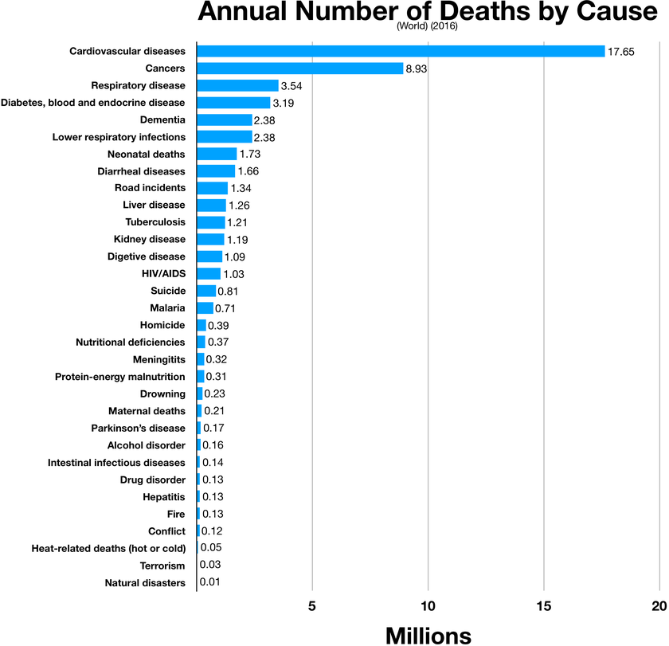
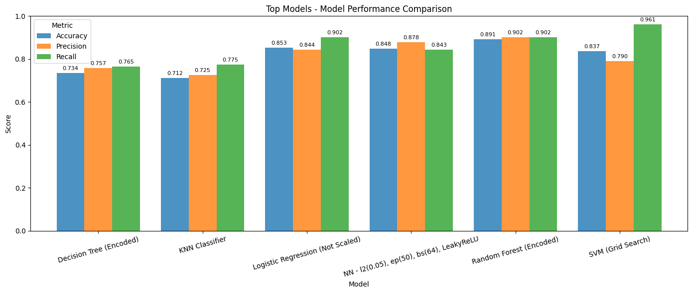

## Introduction

Cardiovascular disease (CVD), commonly known as heart disease is one of the leading causes of death worldwide. Early detection and intervention can drastically improve outcomes, which is why researchers are turning to advanced technologies like machine learning (ML) to help in diagnosing heart disease. The goal is to create systems that can predict heart disease risk based on available health data, enabling healthcare providers to identify at-risk patients and take preventive measures before it’s too late.

<Callout>
**What does this really mean?**

_This article takes about 5 minutes to read. In that short time, roughly 165 people will have lost their lives to cardiovascular disease._

</Callout>

## What is Machine Learning and how does it help?

Machine learning is a type of artificial intelligence (AI) that enables computers to learn patterns from data and make predictions or decisions based on that learning. In the context of heart disease, machine learning models are trained on large datasets of medical information (like test results, patient history, and demographic details) to understand what patterns or features (like cholesterol levels or the presence of specific medical conditions) are most important in predicting the risk of heart disease.

The beauty of machine learning lies in its ability to improve over time. The more data it sees, the better it becomes at making accurate predictions. In this project, several machine learning models were tested to predict heart disease, and the results were quite promising.

---

## The journey of building a heart disease prediction model

A range of machine learning models were tested, each with its own approach to analyzing the data. Here’s a quick breakdown of the models used and how they performed:

1. **K-Nearest Neighbors (KNN):** This model works by finding data points that are similar to a new case and predicting the outcome based on those neighbors. While KNN showed reasonable performance, it wasn’t the top performer for this task.
2. **Decision Trees:** These models work like a flowchart where each decision point is based on a question about the data. For example, “Is the cholesterol level high?” and then branching based on the answer. With some tuning, decision trees were able to perform well.
3. **Random Forest:** Think of this model as a collection of decision trees working together. Random Forest generally outperformed others in terms of both accuracy and precision (the ability to make correct predictions).
4. **Support Vector Machine (SVM):** This model proved to be one of the most effective at correctly identifying heart disease cases. SVM works by finding an optimal line or “hyperplane” that best separates data points into different categories. In this case, it excelled at identifying patients at high risk of heart disease, thanks to a grid search that fine-tuned its performance.
5. **Neural Networks:** Inspired by the human brain, neural networks have multiple layers of connected nodes that process data. They showed great potential but required more data to reach their peak performance. For now, they performed well, but their true power could shine with more training data.

## The Winner: Support Vector Machine (SVM)

Among all the models tested, the Support Vector Machine (SVM) came out on top, especially when using a grid search to fine-tune its parameters. The key to SVM’s success lies in its ability to draw a boundary (hyperplane) that separates data into distinct groups. In this case, it was exceptionally good at identifying patients who are at high risk of heart disease, which is crucial for early intervention.

With an impressive recall rate of 96%, the SVM model was able to correctly identify 96 out of 100 patients who actually had heart disease. This is especially important because missing a heart disease diagnosis could have serious consequences, so the higher the recall, the better.

SVM is effective because it’s great at finding clear patterns in data. For heart disease, there are certain features (such as age, cholesterol levels, and other health indicators) that strongly correlate with the presence of the disease. SVM helps in distinguishing between patients with and without heart disease by maximizing the margin (or gap) between these two groups, ensuring that the decision boundary is as accurate as possible.

### The Challenge with SVM

While SVM is a top performer, there are some challenges. SVMs can become computationally expensive as the amount of data increases, meaning they may not scale well for large datasets. For this project, the dataset was small enough for the model to perform well, but as more data becomes available, this is something to consider.

## Other models that performed well

Besides SVM, Random Forest and Logistic Regression also performed admirably. Random Forest, in particular, was able to handle the complexity of the data and make accurate predictions. It works by using multiple decision trees to “vote” on the correct prediction. Logistic Regression also showed strong results when the data was properly scaled.

---

## Key Takeaways

- **Recall is crucial:** In healthcare, especially in predictive models for serious conditions like heart disease, it's vital to focus on recall (identifying true positives). Missing a heart disease diagnosis could be dangerous, so we want to ensure the model doesn’t overlook patients who are at risk.
- **Feature Importance:** In this study, features like serum cholesterol levels, the number of vessels colored by fluoroscopy, and thalassemia were among the most important for predicting heart disease. This kind of insight can help doctors focus on key metrics when assessing a patient’s risk.
- **Machine learning models improve with more data:** The neural networks, while not the top performer in this study, could outperform other models with access to more data. This is a common trend in machine learning-more data means better performance.

---

## The Future of Heart Disease Prediction

Machine learning models, like the ones discussed here, are revolutionizing the way healthcare professionals approach diagnosis and prevention. With more data, better algorithms, and continuous advancements in AI, we could see even more accurate and accessible tools for predicting heart disease.

These technologies hold the promise of making early detection more widespread, less invasive, and more cost-effective. In the future, heart disease prediction models could even be integrated into wearable devices, helping people monitor their heart health on a daily basis.

The research conducted in this project proves that machine learning isn’t just a futuristic concept-it’s here, and it’s already making strides in improving healthcare outcomes.

By implementing machine learning in medical diagnoses, we can create systems that are not only faster but also smarter, enabling doctors and patients alike to stay one step ahead of potential health risks.

You can read the [full report here →](https://drive.google.com/file/d/1_7QHicRGwLCmD3sWpKsoBZlgghEwYO8l/view?usp=sharing).
